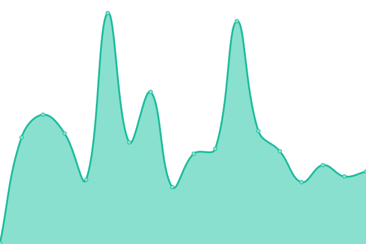
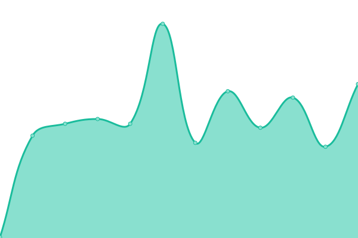
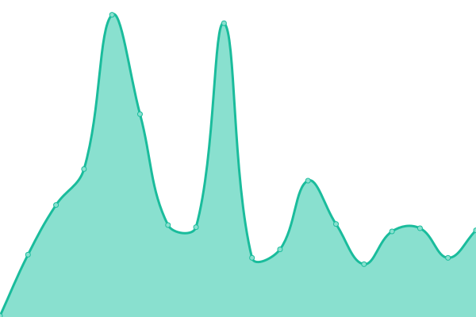
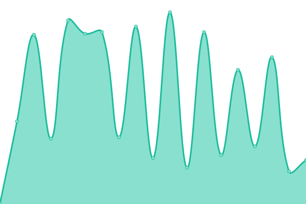

# [📈 Live Status](https://dev.status.luochu.cc): <!--live status--> **🟧 Partial outage**

This repository contains the open-source uptime monitor and status page for [洛初](https://uochu.cc), powered by [Upptime](https://github.com/upptime/upptime).

With [Upptime](https://upptime.js.org), you can get your own unlimited and free uptime monitor and status page, powered entirely by a GitHub repository. We use [Issues](https://github.com/luochu-bot/upptime-status/issues) as incident reports, [Actions](https://github.com/luochu-bot/upptime-status/actions) as uptime monitors, and [Pages](https://dev.status.luochu.cc) for the status page.

<!--start: status pages-->
<!-- This summary is generated by Upptime (https://github.com/upptime/upptime) -->
<!-- Do not edit this manually, your changes will be overwritten -->
<!-- prettier-ignore -->
| URL | Status | History | Response Time | Uptime |
| --- | ------ | ------- | ------------- | ------ |
|  [home](https://home.luochu.cc/) | 🟥 Down | [home.yml](https://github.com/luochu-bot/upptime-status/commits/HEAD/history/home.yml) | 

 139ms
     
 | 

<a href="https://statusdev.luochu.cc/history/home">98.61%</a>
    

|  [blog](https://blog.luochu.cc/) | 🟩 Up | [blog.yml](https://github.com/luochu-bot/upptime-status/commits/HEAD/history/blog.yml) | 

 133ms
     
 | 

<a href="https://statusdev.luochu.cc/history/blog">98.79%</a>
    

|  [sleepy](https://sleepy.luochu.cc/) | 🟩 Up | [sleepy.yml](https://github.com/luochu-bot/upptime-status/commits/HEAD/history/sleepy.yml) | 

 180ms
     
 | 

<a href="https://statusdev.luochu.cc/history/sleepy">99.61%</a>
    

|  [picbed](https://picbed.luochu.cc/) | 🟩 Up | [picbed.yml](https://github.com/luochu-bot/upptime-status/commits/HEAD/history/picbed.yml) | 

 166ms
     
 | 

<a href="https://statusdev.luochu.cc/history/picbed">99.04%</a>
    

|  [tool](https://tool.luochu.cc/) | 🟥 Down | [tool.yml](https://github.com/luochu-bot/upptime-status/commits/HEAD/history/tool.yml) | 

 127ms
     
 | 

<a href="https://statusdev.luochu.cc/history/tool">98.97%</a>
    

|  [ghproxy](https://ghproxy.luochu.cc/) | 🟩 Up | [ghproxy.yml](https://github.com/luochu-bot/upptime-status/commits/HEAD/history/ghproxy.yml) | 

 89ms
     
 | 

<a href="https://statusdev.luochu.cc/history/ghproxy">100.00%</a>
    

|  [rsshub](https://rsshub.luochu.cc/) | 🟥 Down | [rsshub.yml](https://github.com/luochu-bot/upptime-status/commits/HEAD/history/rsshub.yml) | 

 190ms
     
 | 

<a href="https://statusdev.luochu.cc/history/rsshub">99.27%</a>
    

|  [linuxcmd](https://linuxcmd.luochu.cc/) | 🟥 Down | [linuxcmd.yml](https://github.com/luochu-bot/upptime-status/commits/HEAD/history/linuxcmd.yml) | 

 125ms
     
 | 

<a href="https://statusdev.luochu.cc/history/linuxcmd">99.29%</a>
    

|  [status](https://status.luochu.cc/) | 🟩 Up | [status.yml](https://github.com/luochu-bot/upptime-status/commits/HEAD/history/status.yml) | 

 240ms
     
 | 

<a href="https://statusdev.luochu.cc/history/status">91.80%</a>
    

|  servermonitor | 🟩 Up | [servermonitor.yml](https://github.com/luochu-bot/upptime-status/commits/HEAD/history/servermonitor.yml) | 

 200ms
     
 | 

<a href="https://statusdev.luochu.cc/history/servermonitor">99.66%</a>
    

|  urlshort | 🟩 Up | [urlshort.yml](https://github.com/luochu-bot/upptime-status/commits/HEAD/history/urlshort.yml) | 

 98ms
     
 | 

<a href="https://statusdev.luochu.cc/history/urlshort">100.00%</a>
    

|  rssmanage | 🟥 Down | [rssmanage.yml](https://github.com/luochu-bot/upptime-status/commits/HEAD/history/rssmanage.yml) | 

 173ms
     
 | 

<a href="https://statusdev.luochu.cc/history/rssmanage">99.28%</a>
    

|  backend | 🟩 Up | [backend.yml](https://github.com/luochu-bot/upptime-status/commits/HEAD/history/backend.yml) | 

 178ms
     
 | 

<a href="https://statusdev.luochu.cc/history/backend">99.28%</a>
    

<!--end: status pages-->

[**Visit our status website →**](https://dev.status.luochu.cc)

## 📄 License

- Powered by: [Upptime](https://github.com/upptime/upptime)
- Code: [MIT](./LICENSE) © [Anand Chowdhary](https://anandchowdhary.com), supported by [Pabio](https://pabio.com)
- Data in the `./history` directory: [Open Database License](https://opendatacommons.org/licenses/odbl/1-0/)
